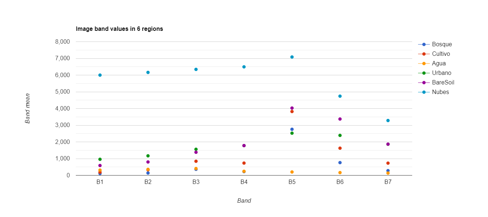
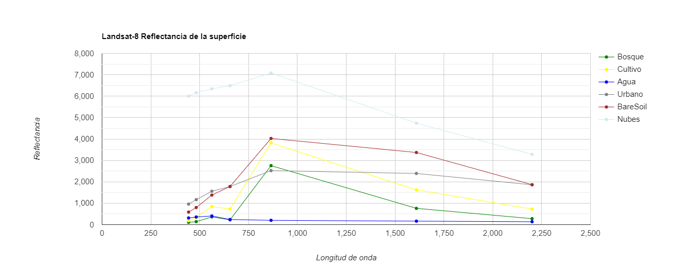
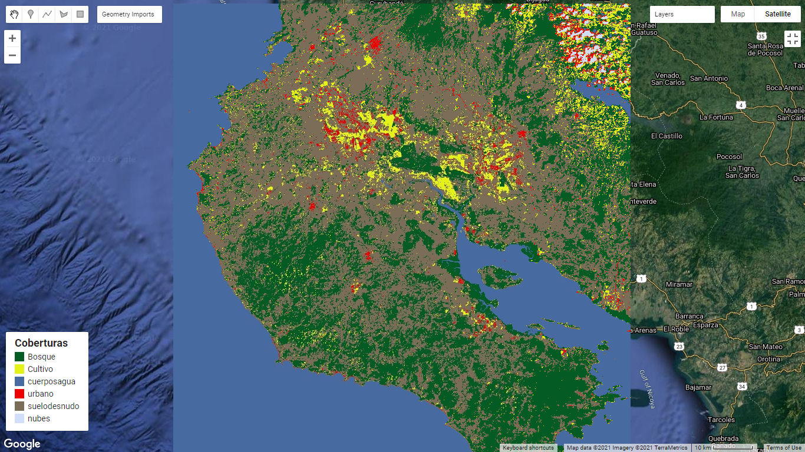
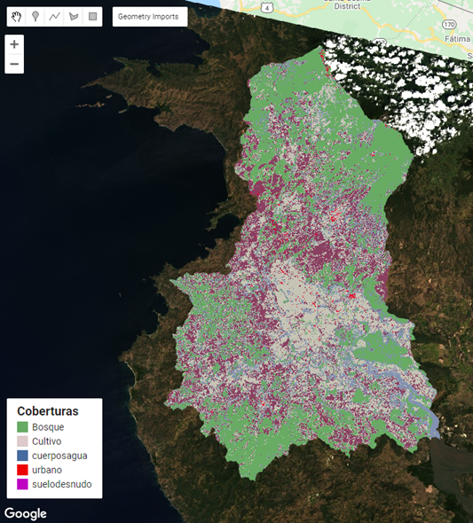
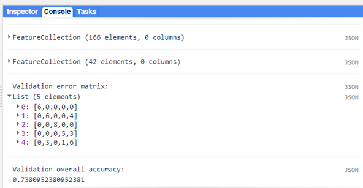
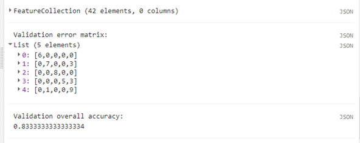

# TP4
Clasificación de imágenes en GEE y matriz de confusión
- Universidad de Costa Rica 
- GF-0618 FOTOGRAMETRÍA Y TELEDETECCIÓN
- MSc.María José Molina Montero
- Estudiantes: Steven Guillén-Ana López  
# Objetivo 
1.	Desarrolle un código para clasificar una imagen Landsat 8 TOA, de un área en Guanacaste

[Código resultante en GEE](https://code.earthengine.google.com/af62011dca308889c00cfd8cb9c129d6)

## Conceptos teóricos 
- Realice una introducción donde explique ¿qué son las clasificaciones supervisadas? ¿Qué es el Machine Learning y cómo se conecta con la teledetección?

La clasificación supervisada es fundamental pues gracias a ello se puede identificar un determinado píxel y clasificarlo para crear distintas categorías.En este tipo de clasificación la persona experta tiene el control del proceso y asigna áreas de entrenamiento conocidas para que posteriormente el algoritmo realice la identificación donde encuentre gupos de píxeles similares a los puntos o polígonos distribuidos previamente en en área de estudio.Finalmente es necesaria una validación del procedimiento.

Para el análisis de imágenes satelitales la clasificación de coberturas terrestres consiste en la agrupación de clases espectrales con determinadas respuestas que finalmente proporciona clases informativas fundamentales para identificar la evolución de un área y los cambios que surgen producto de las dinámicas en la zona de estudio.La clasificación de imágenes satelitales más utilizada es la basada en píxeles 

> *la clasificación supervisada de imágenes, que es el que se lleva a cabo para encontrar propiedades comunes entre un conjunto de datos y clasificarlos dentro de diferentes rangos, de acuerdo a un modelo de clasificación* (García et al.1998 citado en Rojas y Medina, 2021,p.92).

El aprendizaje automático consiste en un subconjunto de la inteligencia artificial en el que los datos estructurados se procesan con un algoritmo para resolver un problema. Su relación con la Teledetección surge en el momento de realizar procesamientos geoespaciales en software GIS posibilitando agrupaciones y clasificaciones.

En el presente trabajo práctico se visualiza como las indicaciones realizadas (con puntos de entrenamiento) para la identificación de coberturas, interactúan con un algoritmo a lo largo del área seleccionada en la región de Guanacaste.  

> *Se han empezado a unir herramientas de sistemas de información geográfica con inteligencia artificial para volver cada vez más eficientes los análisis. Una de las ramas de la inteligencia artificial que más se ha aplicado en el uso de los SIG es el aprendizaje automático (Machine Learning en inglés). Tal y como lo explica Lauren Bennett, líder del desarrollo de software para Análisis Espacial y la Ciencia de Datos en Esri, el aprendizaje automático es un “conjunto de técnicas y algoritmos basados ​​en datos que automatizan la predicción, clasificación y agrupación de datos”. En términos generales, son algoritmos alimentados con información para aprender de ésta y poder replicarse en otras situaciones* [esri Pánama, 2021](https://www.esri.pa/arcgisblog/los-resultados-de-la-fusion-entre-los-sig-y-el-aprendizaje-automatico/). 

## Procedimiento
- Genere curvas de reflectancia para cada una de las coberturas definidas e interprételas brevemente
 

- Para el proceso de clasificación, utilice los clasificadores:
 ### Classification and Regression Trees (CART)–ee.Classifier.smileCart

### RandomForest–ee.Classifier.smileRandomForest 
 
### Clasificación en cuenca Tempisque sin la variable Nubes 
 

- Compare los resultados de ambos clasificadores 

- Realice la matriz de confusión para ambos clasificadores
 >   _CART_
 
 >   _RANDOM FOREST_

En ambas matrices la clasificación del bosque y los cuerpos de agua es óptima. Los errores surgen para la clasificación de cultivos, uso de suelo y urbano 
    

- Conclusiones del ejercicio, aplicaciones de las clasificaciones de imágenes satelitales. Lecciones aprendidas

